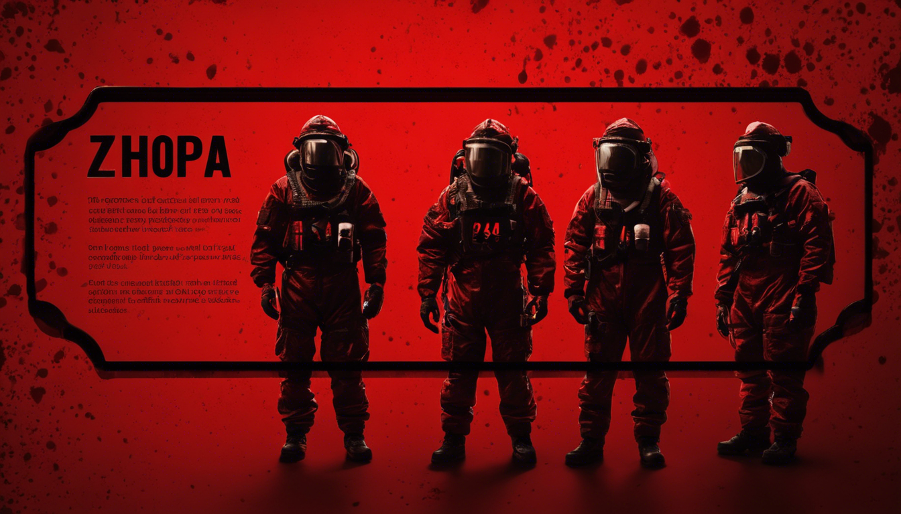

</br>

# Lethal Zhopa

Lethal company mods installation script.

Mods and BepInEx will be cached in the game folder under the `lethal-zhopa-cache` directory to speed up the commands.

Do not use this software if you don't know what are you doing. I will not explain any details or how to run it for you.

All the mods will also be available on the releases page so you could just download the archive from there and extract it to the game folder instead of using this script.

# About modpack

Lethal Zhopa provides different "extensions" - groups of related mods. I mostly focus on QoL changes, so this extension has the largest amount of mods in the whole modpack.

| Extension       | Description                                           | Featured mods                                                     |
| --------------- | ----------------------------------------------------- | ----------------------------------------------------------------- |
| Foundation      | Basic mods setup                                      | MoreCompany, LateCompany, MoreItems, ...                          |
| Fixes           | Mods that fix the game                                | PathfindingLagFix, Boombox Sync Fix, DoorFix, ...                 |
| Quality of Life | Mods that improve the quality of the game             | ShipLoot, DynamicDeadline, MeteoMultiplier, ReservedItemSlot, ... |
| Admin           | Mods that add admin tools to the game                 | ChatCommands                                                      |
| Emotes          | Mods that add emotes to the game                      | TooManyEmotes, TooManyEmotesScrap                                 |
| Anime Suits     | Mod that adds suits from the Blue Archive to the game | Blue Archive Playermodels                                         |
| Scrap           | Mods with additional scrap and items                  | MinecraftScraps, AlltheScrapsMod                                  |
| New Features    | Mods that add new game mechanics                      | LethalProgression                                                 |
| Lite            | Install QoL and bug fixes mods                        |                                                                   |
| Vanilla+        | Install QoL, bug fixes, emotes and new features mods  |                                                                   |
| Full            | Install all available mods                            |                                                                   |

It's recommended to install "metaextensions" - extensions of extensions - "lite", "vanilla+" or "full".

- Lite is a fixed base-game variant with a few QoL mods and several lag/bug fixes.
- Vanilla+ is the same as Lite + emotes and new features (LethalProgression).
- Full is full.

> Note: scrap mods were not updated by the maintainers for a long period of time and can be broken.
> Thus using full build might not be a good idea.

# How to use?

## List available mods extensions

Mods extension is a group of theme related mods and their libraries.

```bash
python3 lethal-zhopa.py list
```

## Setup mods extensions to the game

To install the mods loader without any actual mods:

```bash
python3 lethal-zhopa.py setup 'C:\Games\Lethal Company' engine
```

To install some extensions:

```bash
python3 lethal-zhopa.py setup 'C:\Games\Lethal Company' fixes qol emotes
```

To install all the available mods from the Lethal Zhopa modpack:

```bash
python3 lethal-zhopa.py setup 'C:\Games\Lethal Company' full
```

## Remove all the mods from the game

```bash
python3 lethal-zhopa.py remove 'C:\Games\Lethal Company'
```

## Wine support

Linux users need to force wine to load the custom `winhttp.dll` library with a hook
for a mod loader to launch. This can be achieved by adding this environment variable
to the game launch (steam options):

```bash
WINEDLLOVERRIDES="winhttp=n,b" %command%
```

Author: [Nikita Podvirnyi](https://github.com/krypt0nn)\
Licensed under [Unlicense](LICENSE)
