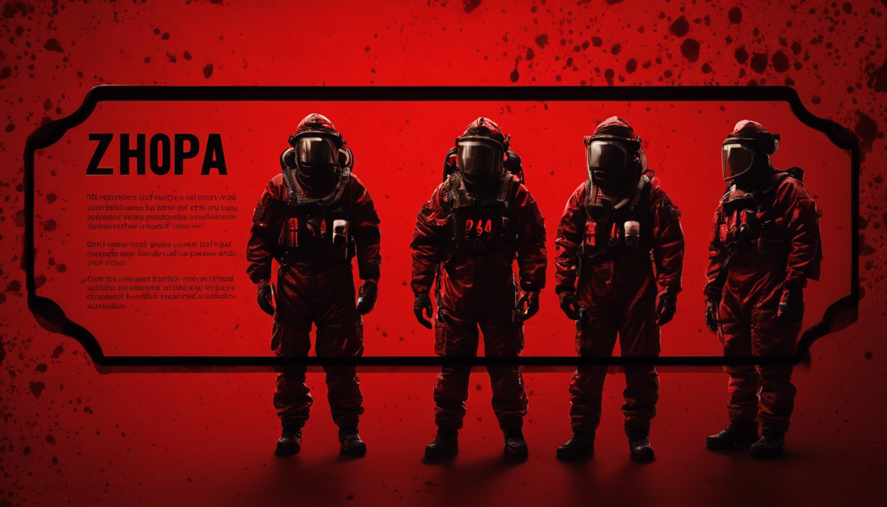

</br>

# Lethal Zhopa

Lethal Company mods installation script.

Mods and BepInEx will be cached in the game folder under the
`lethal-zhopa-cache` directory to speed up the commands.

Do not use this software if you don't know what are you doing. I will not
explain any details or how to run it for you.

All the mods will also be available on the releases page so you could just
download the archive from there and extract it to the game folder instead of
using this script.

# About modpack

Lethal Zhopa provides different "extensions" - groups of related mods. I mostly
focus on QoL changes, so this extension has the largest amount of mods in the
whole modpack.

| Extension       | Description                                           | Featured mods                                     |
| --------------- | ----------------------------------------------------- | ------------------------------------------------- |
| Foundation      | Basic mods setup                                      | MoreCompany, LateCompany, MoreItems, ...          |
| Fixes           | Mods that fix the game                                | PathfindingLagFix, Boombox Sync Fix, DoorFix, ... |
| Quality of Life | Mods that improve the gaming experience               | ShipLoot, DynamicDeadline, ReservedItemSlot, ...  |
| HUD             | Mods that change the game UI or add new elements      | ShipLootCruiser, EladsHUD                         |
| Emotes          | Mods that add emotes to the game                      | TooManyEmotes, TooManyEmotesScrap                 |
| Suits           | Mod that adds more suits to the game                  | TooManySuits, More Suits                          |
| Scrap           | Mods with additional scrap and items                  | AlltheScrapsMod                                   |
| Enemies         | Mods that add new enemies or update existing ones     | Mimics                                            |
| VR              | Mods that add VR headset support to the game          | LethalCompanyVR, ...                              |
| Admin           | Mods that add admin tools to the game                 | ChatCommands, NiceChat                            |
| Lite            | Install QoL and bug fixes mods                        |                                                   |
| Vanilla+        | Install QoL, bug fixes, emotes and suits mods         |                                                   |
| Full            | Install all available mods                            |                                                   |

It's recommended to install "meta-extensions" (groups of extensions):

- Lite (`lite`) is a base game with fixes, performance improvements, quality
  of life changes, and updated HUD. No base game mechanics are changed and no
  new content is added.
- Vanilla+ (`vanilla+`) is an extension of Lite that adds new emotes and suits.
  Base game is kept unchanged as well.
- Full (`full`) adds all the available mods, which is Vanilla+ with addition of
  new scrap and enemies.

VR mods are never installed automatically so you need to add `vr` as a suffix to
the `setup` command.

# How to use?

## List available mods extensions

Mods extension is a group of theme related mods and their libraries.

```bash
python3 lethal-zhopa.py list
```

## Setup mods extensions to the game

To install the mods loader without any actual mods:

```bash
python3 lethal-zhopa.py setup 'C:\Games\Lethal Company' engine
```

To install some extensions:

```bash
python3 lethal-zhopa.py setup 'C:\Games\Lethal Company' fixes qol emotes
```

To install all the available mods from the Lethal Zhopa modpack:

```bash
python3 lethal-zhopa.py setup 'C:\Games\Lethal Company' full
```

## Remove all the mods from the game

```bash
python3 lethal-zhopa.py remove 'C:\Games\Lethal Company'
```

## Wine support

Linux users need to force wine to load the custom `winhttp.dll` library with a
hook for a mod loader to launch. This can be achieved by adding this environment
variable to the game launch (steam options):

```bash
WINEDLLOVERRIDES="winhttp=n,b" %command%
```

Author: [Nikita Podvirnyi](https://github.com/krypt0nn) \
Licensed under [Unlicense](LICENSE)
